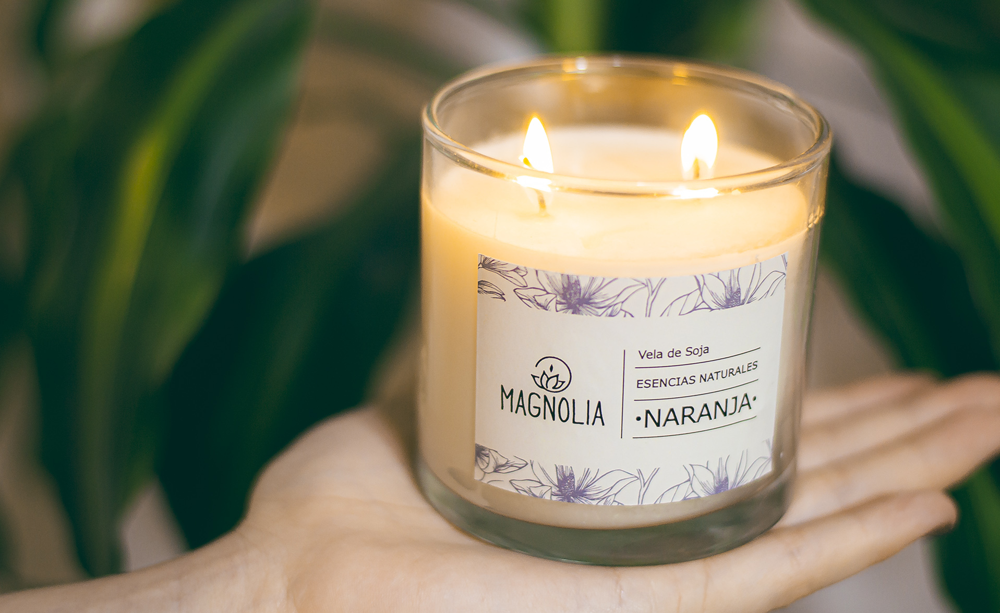
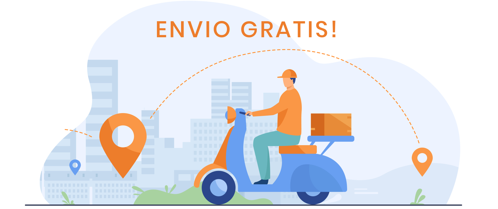
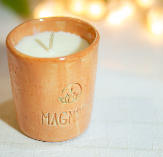
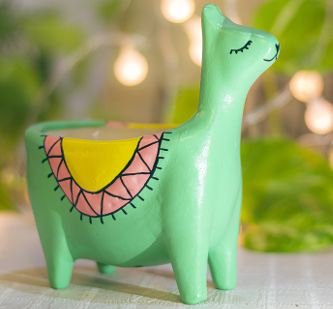

<!DOCTYPE html>
<html lang="es">

<head>
  <meta charset="utf-8">
  <meta name="description" content="Sitio contruido con BULMA CSS para reto 4">

  <link rel="stylesheet" href="./css/estilos.css">
  <link rel="stylesheet" href="./bulma-0.9.0/css/bulma.min.css">
  <link rel="stylesheet" href="./css/animations.css">

  <link href="https://fonts.googleapis.com/css2?family=Scope+One&display=swap" rel="stylesheet">
  <link href="https://fonts.googleapis.com/css2?family=Ubuntu:wght@500&display=swap" rel="stylesheet">

  
  
  

  <title>Magnolia</title>
</head>

<body>
  <nav class="navbar is-transparent is-fixed-top is-spaced">
    

      

        
        <a role="button" class="navbar-burger burger has-text-light" aria-label="menu" aria-expanded="false"
          data-target="navbar-burger">
          
          
          
        </a>
      

      

        

          <a href="./productos.html" class="navbar-item  is-size-5 has-text-light">Productos</a>
          <a href=" ./faqs.html" class="navbar-item  is-size-5 has-text-light">FAQs</a>
          <a href="./faqs.html#como_comprar" class="navbar-item  is-size-5 has-text-light">Comprar</a>
        

      

    

  </nav>

  <!-- HERO -->
  <section class="hero is-fullheight">
    

      <figure class="image is-fullwidth">
        
        

          

            
Linea GLASS

          

        

      </figure>
    

  </section>

  <!-- SECCION ENVIO GRATIS -->
  <section>
    

      

        <figure class="image is-fullwidth">
          
        </figure>
      

    

  </section>

  <!-- SECCION DESTACADOS -->
  

    

      <h1 class="title has-text-centered ">DESTACADOS</h1>
    

    

      

        

          <a href="productos.html">
          <figure class="image"></figure>
          
Linea Ceramica

          

            Velas en cuencos de cerámica, rústicos y pintorescos, para darle color y aromatizar los rincones. Son la
            opción más elegida!
          

          </a>
        

      

      

        

          <a href="productos.html">
            <figure class="image"></figure>
            
Limited Edition

            

              Hermosas velas realizadas en recipientes limitados. Publicaremos en nuestras redes sociales cuando haya
              una edición limitada!
            

            </a>
        

      

    

  

  <footer class="footer has-background-black-ter">
    

      

        <i class=" far fa-copyright"></i>
        Francisco Fourcade 2020
      

      

        
      

      

        <i class="fas fa-tasks"></i>
        Reto 4 - Programacion 2 - 2020
      

    

    
<a class=" subtitle has-text-light" href="./terminos.html">Términos y
        Condiciones</a>
    

    

      
    

    

    

  </footer>

  
  
</body>

</html>
